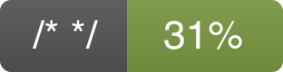

 &nbsp;
 &nbsp;
 &nbsp;
 &nbsp;
 &nbsp;

## Quickstart

To use the code metrics as a package use the setup script with

    python setup.py install

Go to the root folder of your source code and run

    python -m metrics

Ideally, there should be a `tests` folder containing your unit tests.
Additional help is available with

    python -m metrics -h

## Metrics

The metrics computed by this package are provided by unit tests and the
[radon](http://radon.readthedocs.io/en/latest/intro.html) package.
Deeper explanation of the metrics can be obtained by reading their
corresponding documentation.

In a nutshell, here is a succinct description of the metrics:

| Name | Type | Description |
| --- | --- | --- |
| Code path | string | Path of the evaluated code |
| Report date | date | Metrics report production date |
| Documentation rate | \[0,1\] | Documentation rate wrt. total number of lines |
| Lines of code | positive integer | Number of logical lines of code |
| Maintainability index |\[0,1\] | Maintainability index computed by Radon |
| Tests coverage | \[0,1\] | Coverage rate of the unit tests |

